# PWMLab

An interactive Streamlit app to explore carrier-based PWM in power electronics: half bridge,
full bridge and three-phase inverter, with gate signals, dead time, regular sampling, harmonic
spectra, switch losses, power quantities, thermal model and Clarke/Park analysis. Move a slider and
the carrier, gate signals, output voltages, spectrum, load current, losses and temperatures follow.
A Theory page collects the formulas and schematics behind it.

It is not a circuit simulator: switches are ideal, the DC bus is stiff and the load is a linear
series R-L. The goal is to see how a modulation scheme behaves and why, not to replace a
detailed simulation.

**Try it online:** https://…streamlit.app

## Screenshots

**Three-phase inverter.** Gate signals of the six switches, pole, line, phase and common-mode voltages and the
load current, here with SVPWM.

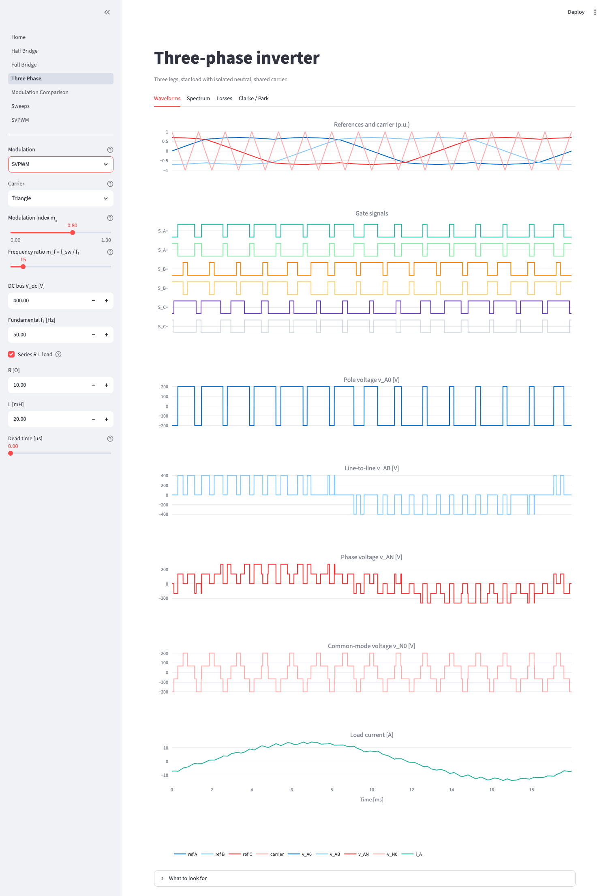

**Clarke / Park.** Space vector of the phase voltage on the hexagon, its carrier average, and the d and q
components.

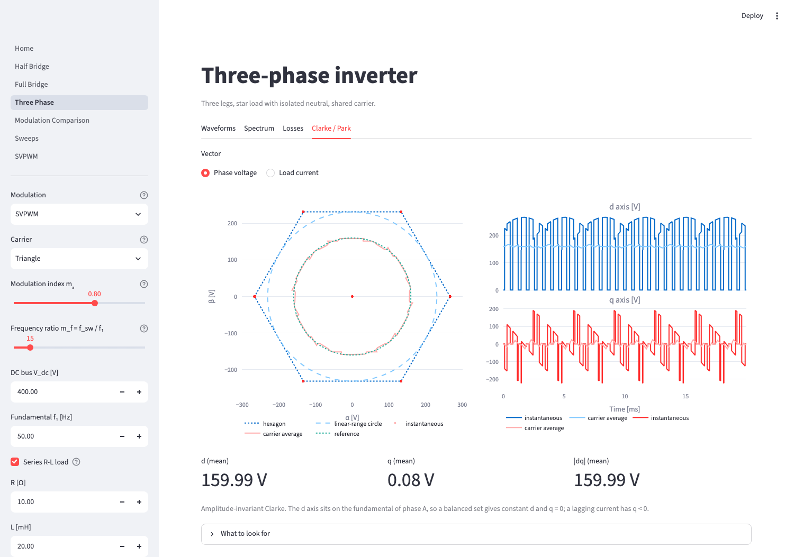

**Half bridge with a sawtooth carrier.** One edge of the gate signal is locked to the carrier period.

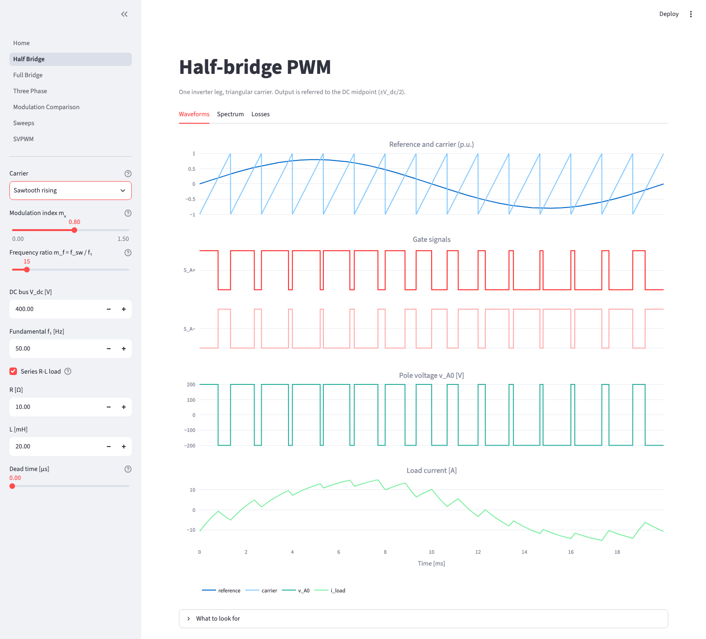

**Modulation comparison.** Same m_a, f_sw, load and dead time for every modulation: losses, ripple, common-mode
voltage, thermal figures and power quantities.

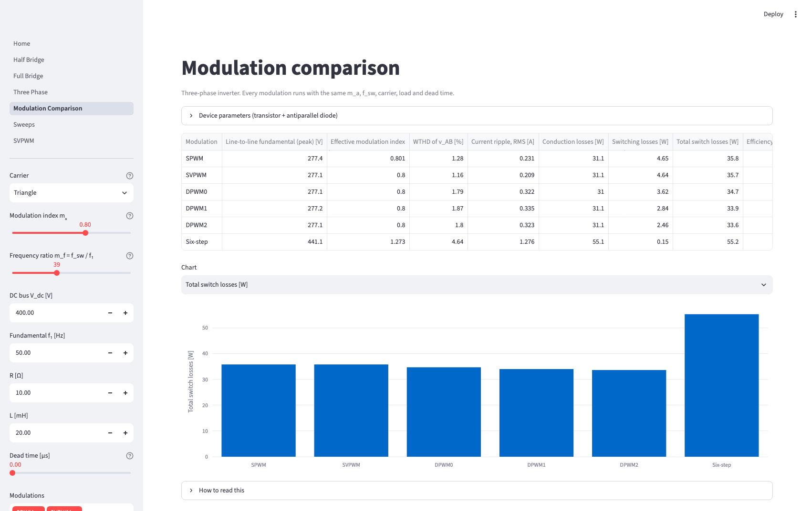

**Single-phase comparison.** Half bridge and full bridge, bipolar and unipolar, triangle and sawtooth: the unipolar
bridge with a triangle carrier cuts the current ripple by 72 % at the same switching losses.

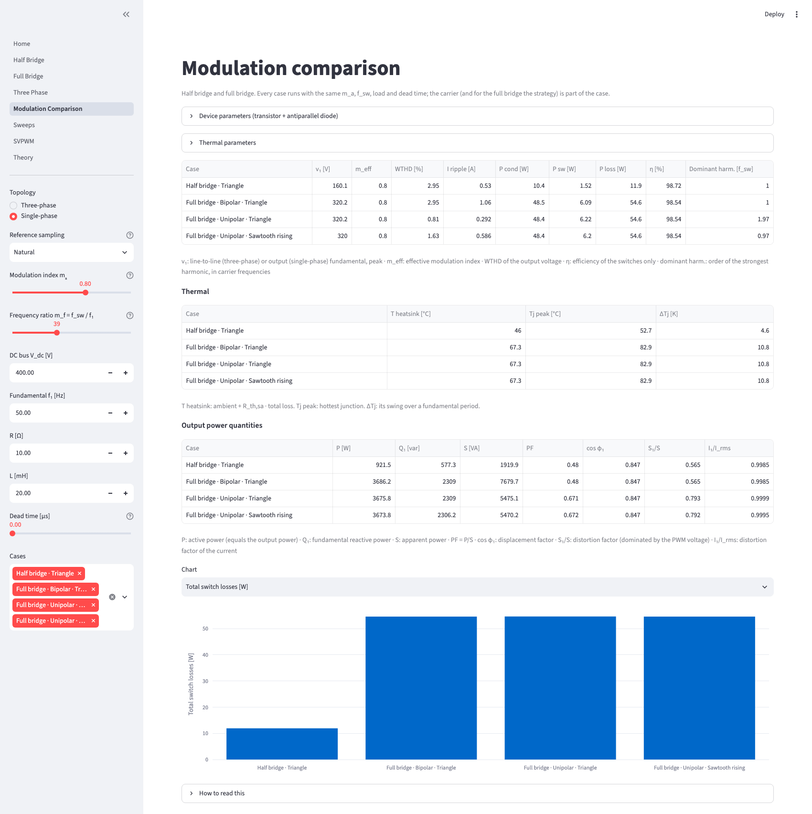

**Sweeps.** WTHD, current ripple, switching losses, efficiency and peak junction temperature against the switching
frequency up to 20 kHz. DPWM2 recovers about 0.8 points of efficiency over SPWM at 20 kHz.

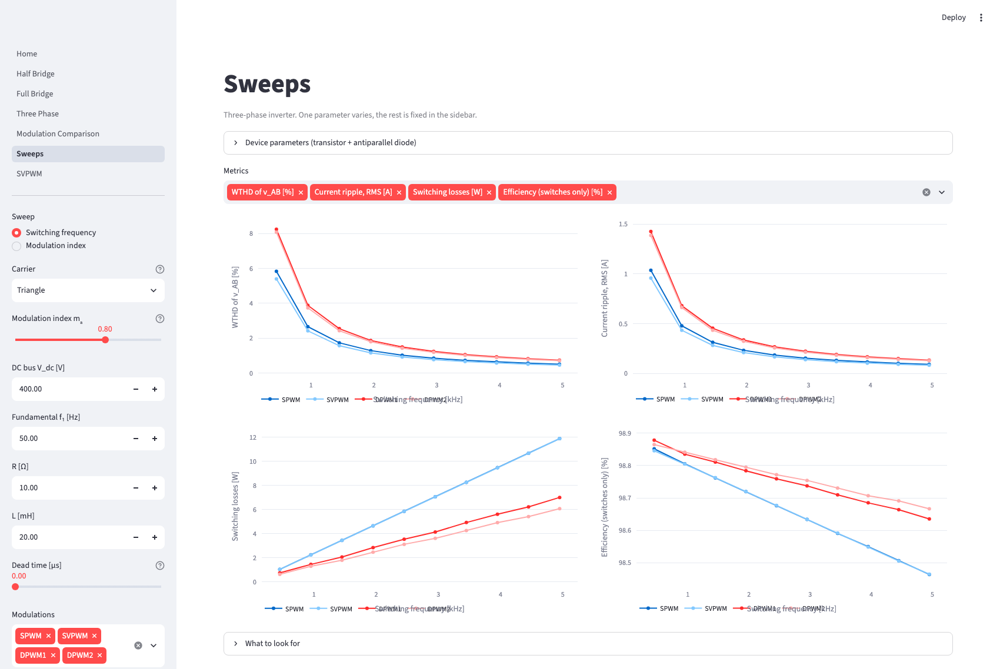

**Space-vector PWM, step by step.** Sector, dwell times and the decomposition of the reference vector.

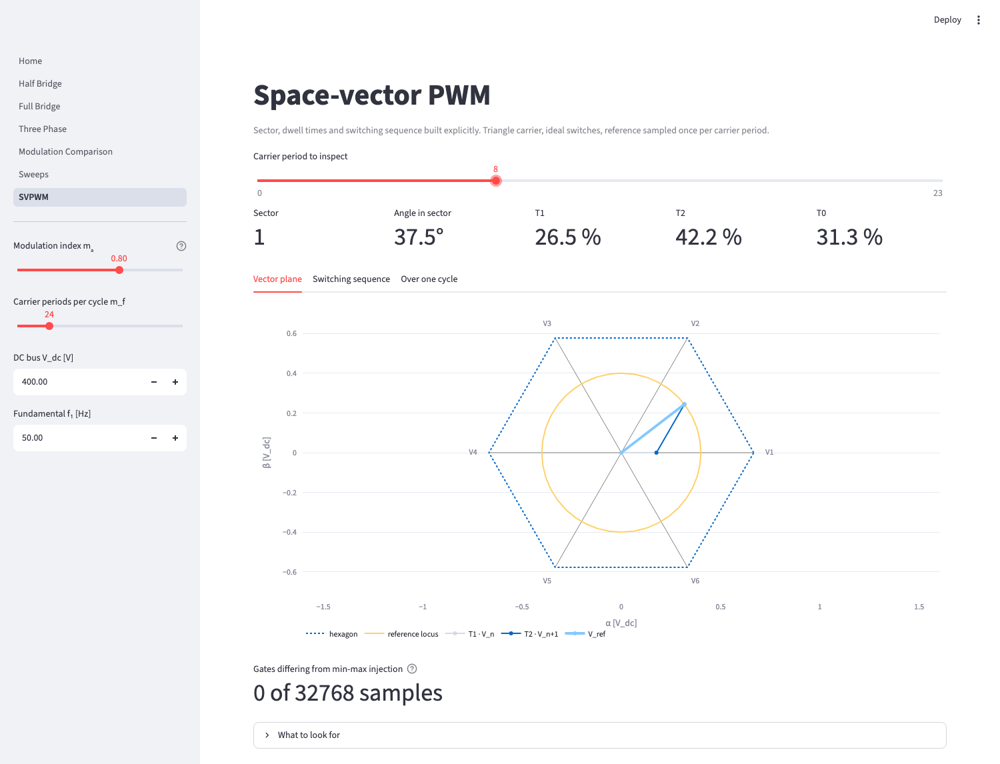

**Thermal model.** Heatsink and junction temperatures, and the swing of each device over a fundamental period.

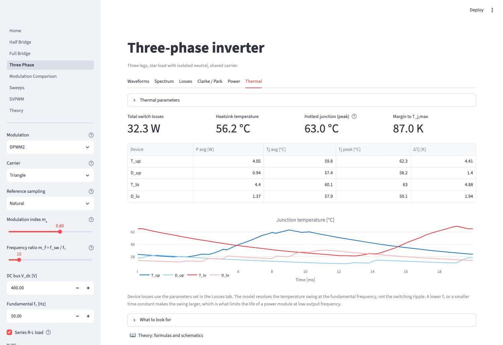

**Theory.** Formulas and schematics, with a live check of the harmonic formula against the simulation.

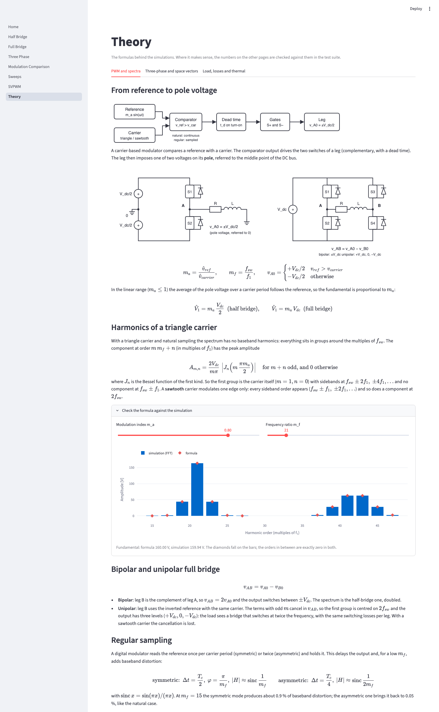
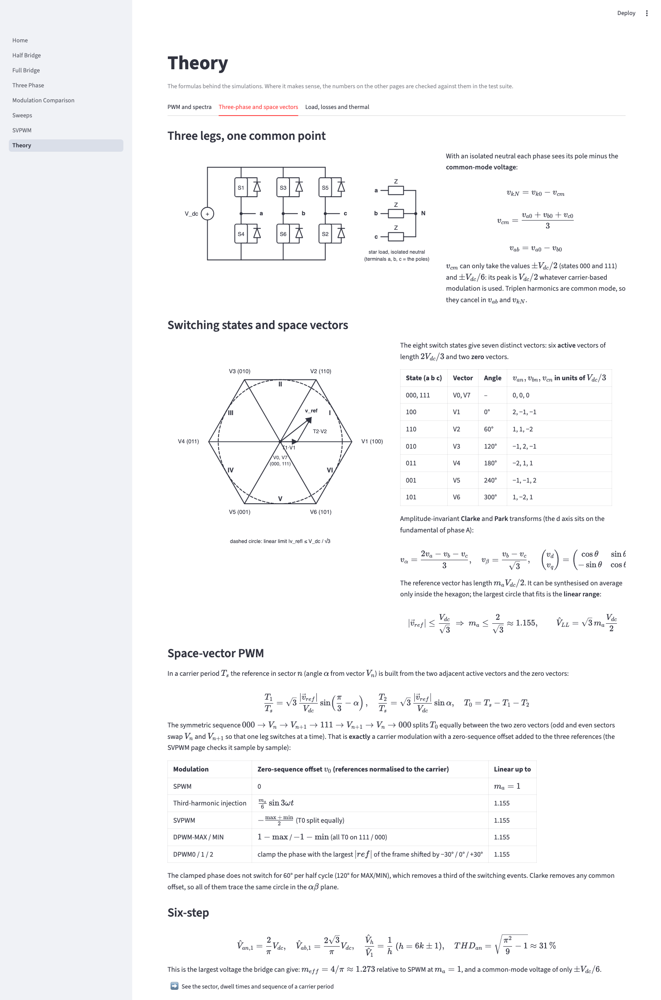
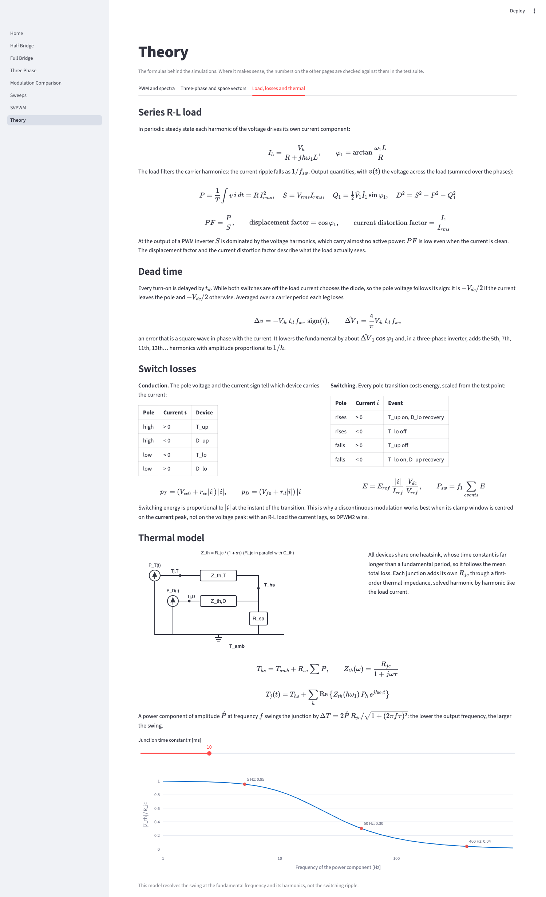

## What is in it

Every simulation page shares the same controls: carrier (triangle, rising sawtooth, falling sawtooth),
reference sampling (natural, symmetric or asymmetric regular sampling), modulation index m_a, frequency
ratio m_f = f_sw / f_1, DC bus, fundamental frequency, an optional series R-L load and, with the load
enabled, the dead time.

| Page | Topology | What you can compare |
|---|---|---|
| Half bridge | One leg, pole voltage at +/- V_dc/2 | Spectrum with triangle vs sawtooth, effect of dead time and of regular sampling |
| Full bridge | Two legs | Bipolar vs unipolar PWM, with a triangle or a sawtooth carrier |
| Three-phase | Three legs, star load, isolated neutral | SPWM, third-harmonic injection, SVPWM, DPWM0/1/2, DPWM-MAX/MIN, six-step |

Each of these pages has tabs:

- **Waveforms**: reference and carrier, gate signals of every switch, pole, line, phase and
  common-mode voltages, load current.
- **Spectrum**: harmonic spectrum of any signal, absolute or as % of the fundamental, with THD and
  WTHD (harmonics weighted by 1/h).
- **Losses** (needs the load): conduction and switching losses of transistor and diode of one leg,
  loss breakdown chart, output power and efficiency of the switches. Device parameters are editable.
- **Clarke / Park** (three-phase): space vector in the alpha-beta plane with the hexagon and the
  linear-range circle, instantaneous vector vs carrier-averaged vector, d and q components of the
  phase voltage or of the load current.
- **Power** (needs the load): active, reactive, apparent and distortion power, power factor,
  displacement factor and distortion factors of voltage and current, and the instantaneous power.
- **Thermal** (needs the load): heatsink and junction temperatures from the device losses. All devices
  share one heatsink; each junction adds its R_jc through a first-order thermal impedance, so the
  temperature swing at the fundamental frequency is resolved (not the switching ripple).

## Analysis pages

- **Modulation comparison**: for the three-phase inverter (every selected modulation) or for the half and
  full bridge (carrier and strategy are part of the case), at the same m_a, f_sw, load and dead time.
  Tables with the fundamental, effective modulation index, WTHD, current ripple, losses, efficiency,
  thermal figures and power quantities, plus a bar chart of any metric. The R-L load is always on in this page.
- **Sweeps**: the same metrics against the switching frequency (up to m_f = 399, i.e. 20 kHz at 50 Hz) or
  against the modulation index, from the linear range to six-step, for several cases at once.
- **Space-vector PWM**: SVPWM built explicitly. Sector, dwell times T1/T2/T0 and the switching sequence of
  any carrier period, the reference vector on the hexagon, and a counter that checks the gates against
  the min-max injection.
- **Theory**: three tabs with formulas and schematics (PWM and spectra; three-phase and space vectors;
  load, losses and thermal), with two live checks against the simulation.

The metrics live in `pwmlab/metrics.py`, so the tables and the sweeps share the same code.

## Three-phase modulations

| Modulation | Zero-sequence term |
|---|---|
| SPWM | None, pure sines. Linear up to m_a = 1 |
| Third-harmonic injection | 1/6 of the third harmonic. Linear up to m_a = 1.155 |
| SVPWM | Min-max injection (centred zero vectors). Linear up to m_a = 1.155 |
| DPWM0 / DPWM1 / DPWM2 | One phase clamped to a rail for 60 degrees per half cycle. The window is centred -30 / 0 / +30 degrees from the peak of the phase voltage |
| DPWM-MAX / DPWM-MIN | One phase clamped for 120 degrees on a single rail (upper / lower) |
| Six-step | Square-wave operation, 180 degree conduction. m_a, m_f and the carrier are ignored |

The best DPWM window follows the current peak, not the voltage peak: with a current lagging by about
30 degrees (the default R-L load) DPWM2 gives the lowest switching losses. DPWM0 would suit a leading
current, which an R-L load cannot produce. The DPWM naming is not uniform in the literature, so the
convention above is the one used here.

## Models and conventions

- Ideal switches and a stiff DC bus. All voltages are referred to the DC midpoint, so a pole voltage is
  +V_dc/2 or -V_dc/2.
- m_a is the peak of the reference over the carrier amplitude, i.e. the peak phase voltage over V_dc/2.
  m_f must be an integer, so the pattern repeats every fundamental period.
- Everything is computed on a grid of 2^15 samples per fundamental period. Spectra are FFTs over exactly
  one period, so there is no leakage.
- The load is a series R-L in periodic steady state, solved harmonic by harmonic (I_h = V_h / Z_h).
  The three-phase load is a balanced star with isolated neutral.
- Reference sampling: natural sampling compares the reference continuously (analog). Symmetric regular
  sampling reads it once per carrier period, at the carrier peak; asymmetric reads it twice, at peak and
  trough. Regular sampling delays the output by 1/2 or 1/4 of a carrier period and scales the fundamental
  by about sinc(f_1 / f_update); at low m_f the symmetric mode adds baseband distortion. With regular
  sampling the six-step edges snap to the carrier grid, so m_f then matters slightly.
- Dead time delays every turn-on and leaves turn-off immediate. While both switches are off the load
  current picks the diode: current leaving the pole flows through the lower diode, current entering it
  through the upper one. Voltage and current depend on each other, so the pole voltage is found by a few
  fixed-point iterations. The grid resolution is 1 / (f_1 * 2^15), and the effective dead time is shown
  in the sidebar.
- DPWM0/1/2 take the clamp decision once per carrier period and hold it, as a digital controller does.
  Near the window edges an unclamped reference can therefore exceed +/-1 slightly: the modulator
  saturates it and the fundamental is unaffected. With regular sampling the decision is taken at the
  sampling instant and the references stay inside the carrier.
- Losses: transistor and diode conduction as V_0 + r*i, switching energies (E_on, E_off, diode E_rr)
  scaled linearly with current and DC voltage from the test point, applied at every pole transition.
  One leg is computed and scaled by the number of legs, assuming symmetry. Efficiency counts the
  switches only.
- Thermal model: the heatsink follows the mean total loss (T_hs = T_amb + R_sa * sum P); each junction is
  solved in the frequency domain, Tj(t) = T_hs + IFFT{ P_h * Z_th(h w1) } with Z_th = R_jc / (1 + j w tau).
  Losses of one leg are computed and the others assumed identical.
- Power quantities: P is the mean of v*i summed over the phases (it equals R * I_rms^2), Q_1 is the
  fundamental reactive power, S = V_rms * I_rms and D^2 = S^2 - P^2 - Q_1^2. At the output of a PWM inverter
  S is dominated by the voltage harmonics, so PF and S_1/S are low even for a clean current; the
  displacement factor and the current distortion factor I_1 / I_rms describe what the load sees.
- Single-phase cases: the carrier (and for the full bridge the strategy) is part of the case; m_eff is
  normalised to V_dc/2 for the half bridge and to V_dc for the full bridge.
- Clarke is amplitude-invariant. The Park d axis sits on the fundamental of phase A, so a balanced set
  gives constant d and q = 0, and a lagging current has q < 0.

## Run it locally

Python 3.11 or newer.

```bash
python -m venv .venv
# Windows:     .venv\Scripts\activate
# macOS/Linux: source .venv/bin/activate
pip install -r requirements.txt
streamlit run Home.py
```

Open the folder in VS Code, select the `.venv` interpreter, and run the command in the integrated
terminal.

## Tests

```bash
pip install -r requirements-dev.txt
pytest
```

The tests compare the results with closed-form or textbook values rather than with themselves:

- fundamental amplitudes and linear modulation limits for every topology and modulation
- the bipolar full-bridge carrier harmonic (a Bessel-function value), harmonic cancellation in the
  line-to-line voltage, loss of frequency doubling in the unipolar bridge with a sawtooth
- carrier shapes and the edge locked to the carrier period in sawtooth modulation
- regular sampling: delay of 1/2 and 1/4 of a carrier period, amplitude close to sinc, symmetric pulses,
  baseband distortion of the symmetric mode, DPWM references inside the carrier
- six-step: fundamental 2*sqrt(3)/pi * V_dc, harmonics 1/h, phase-voltage THD of 31 %
- dead time: no gate overlap, gap duration, self-consistency with the current, the fundamental against an
  analytic phasor estimate, 5th/7th/11th harmonics proportional to 1/h
- loss identities (conduction losses add up to r*i^2, switching losses scale with V_dc), DPWM
  switching less than SPWM, best clamp window for a lagging current
- thermal model: power waveforms average to the loss model, DC gain, swing equal to |Z_th| of the harmonic,
  heatsink and average junction temperature identities
- power quantities: a pure sine pair, P = R * I_rms^2, Q_1 = X * I_1^2 and cos(phi_1) = R / |Z| for the
  PWM-fed R-L load, current distortion factor
- Clarke/Park of a balanced set, invisibility of the zero-sequence term in alpha-beta, sign of q for a
  lagging current
- metrics: ripple scales as 1/f_sw, switching losses as f_sw, six-step common mode is V_dc/6, effective
  modulation index up to 4/pi, DPWM saves switching loss without reducing common-mode voltage
- single-phase: unipolar moves the dominant harmonic to 2 f_sw and cuts the ripple at the same switching
  losses, full bridge = twice the half bridge
- explicit SVPWM: gates identical to the min-max injection, dwell times add up to 1, sectors advance 1 to 6,
  one leg switches at a time
- theory: Bessel harmonic amplitudes against the FFT (and exact zeros where the formula predicts them),
  common-mode levels, well-formed schematics

## Regenerating the screenshots

The images in `docs/images/` are taken from the running app:

```bash
pip install playwright pillow
playwright install chromium
python scripts/make_screenshots.py            # all of them
python scripts/make_screenshots.py theory     # only those whose name contains "theory"
```

## Project layout

```
Home.py                landing page
pages/                 one file per page (Streamlit builds the sidebar navigation from this folder)
pwmlab/core.py         all the maths: pure NumPy, no Streamlit
pwmlab/metrics.py      scalar metrics of a simulation (WTHD, current ripple, losses, common mode, power, thermal...)
pwmlab/theory.py       closed-form results used by the Theory page and its tests
pwmlab/schematics.py   SVG schematics for the Theory page
pwmlab/plots.py        Plotly figures
pwmlab/ui.py           sidebar widgets, tabs and result layout
tests/                 pytest suite
docs/images/           screenshots used in this README
scripts/               make_screenshots.py regenerates them (needs playwright)
```

## Roadmap

- Generalised SVPWM with an adjustable zero-vector split: all 000, equal split and all 111 should
  reproduce DPWM-MIN, SVPWM and DPWM-MAX
- Overmodulation in the space-vector domain (mode I and II), compared with the carrier-based result
- Datasheet-based device data: switching energy curves instead of linear scaling
- Exact Fourier series instead of the FFT
- R-L load with back-EMF, and the start-up transient
- Cross-check of selected cases against ngspice (via PySpice)

## License

MIT